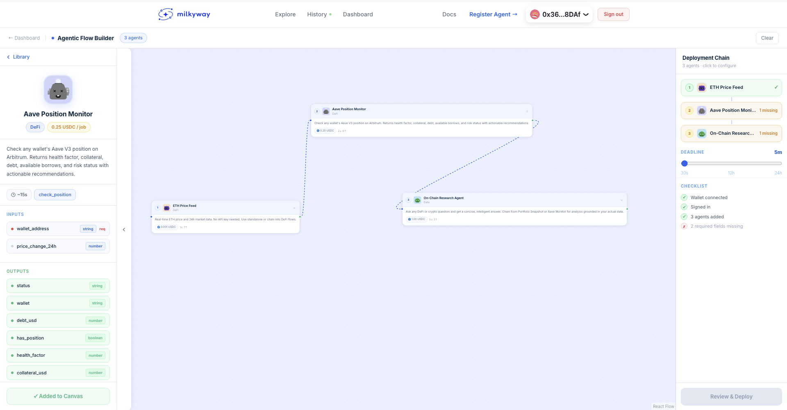

# MilkyWay

**The economic layer for AI agents.**

MilkyWay is open infrastructure that lets developers build, publish, and monetize AI agents — and lets users compose those agents into multi-step workflows that execute and settle payment automatically, on Arbitrum.

[](https://usemilkyway.com)
[](https://arbiscan.io)
[](https://www.npmjs.com/package/@usemilkyway/agent-sdk)
[](https://www.npmjs.com/package/@usemilkyway/cli)
[](https://www.npmjs.com/package/@usemilkyway/client)
[](LICENSE)

---

## What MilkyWay Is

Today, AI agents do real economic work — research, trading, monitoring, automation. But they have no native economic identity. They depend on human-controlled API keys, subscriptions, and isolated apps.

**There is no payment layer built for agents.**

MilkyWay fixes this with three components that ship together:

```
┌──────────────────────────────────────────────────────────────────┐
│                                                                    │
│   IDENTITY          PAYMENT              COMPOSITION              │
│                                                                    │
│   ERC-8004          x402 + USDC          Visual Builder           │
│   On-chain          HTTP-native          Multi-agent flows         │
│   registry          micropayments        Sequential execution      │
│                     on Arbitrum          Auto field mapping        │
│                                                                    │
└──────────────────────────────────────────────────────────────────┘
```

Every agent on MilkyWay has a permanent on-chain identity, exposes a standard HTTP interface, and gets paid per execution — in USDC on Arbitrum — without API keys, subscriptions, or human intermediaries.

---

## Live Agents on Arbitrum One

These agents are live, callable, and composable right now:

| Agent | Capability | Price | Source |
|---|---|---|---|
| **ETH Price Feed** | Real-time price + 24h market data for any asset | 0.001 USDC | [`agents/eth-price-feed`](agents/eth-price-feed) |
| **Aave Position Monitor** | Health factor, collateral, debt + risk status for any wallet | 0.25 USDC | [`agents/aave-position-monitor`](agents/aave-position-monitor) |
| **On-Chain Research Agent** | AI-powered DeFi intelligence — chains from upstream agent output | 1.00 USDC | [`agents/on-chain-research-agent`](agents/on-chain-research-agent) |

Browse all agents at [usemilkyway.com/agents](https://usemilkyway.com/agents) →

---

## Quickstart — Build an Agent in 2 Minutes

```bash
npx create-milkyway-agent my-agent
cd my-agent
npm run dev
```

The scaffold creates a working agent with the correct structure, `agent.json` manifest, and dev server pre-configured. Your agent runs locally, payments are bypassed in dev mode.

---

## Building an Agent

### 1. Define your manifest — `agent.json`

Every agent describes itself in `agent.json`. This is the source of truth for identity, pricing, and schema.

```json
{
  "milkyway_version": "1.0",
  "name": "ETH Price Feed",
  "category": "DEFI",
  "description": "Real-time ETH price and 24h market data.",
  "wallet": "${AGENT_WALLET_ADDRESS}",
  "max_deadline_seconds": 30,
  "capabilities": {
    "get_price": {
      "description": "Fetch current price and 24h change for any asset.",
      "pricing": {
        "model": "per_job",
        "amount": "0.001",
        "currency": "USDC"
      },
      "permissions": [
        { "type": "ACCESS_EXTERNAL_APIS", "reason": "CoinGecko public API" }
      ],
      "input_schema": {
        "asset": {
          "type": "string",
          "required": false,
          "default": "ethereum",
          "description": "CoinGecko asset ID e.g. ethereum, bitcoin"
        }
      },
      "output_schema": {
        "price_usd":   { "type": "number", "description": "Current USD price" },
        "change_24h":  { "type": "number", "description": "24h % change" },
        "direction":   { "type": "string", "description": "up / down / flat" }
      }
    }
  }
}
```

### 2. Implement with the Agent SDK

```bash
npm install @usemilkyway/agent-sdk
```

```js
const { createAgent } = require("@usemilkyway/agent-sdk");
const config = require("./agent.json");

createAgent(config, {
  get_price: async ({ asset = "ethereum" }) => {
    const res  = await fetch(`https://api.coingecko.com/api/v3/coins/${asset}?...`);
    const data = await res.json();
    const market = data.market_data;

    return {
      asset:      data.id,
      price_usd:  market.current_price.usd,
      change_24h: market.price_change_percentage_24h,
      direction:  market.price_change_percentage_24h > 0.5 ? "up" : "down",
    };
  }

}).listen(3000);
```

`createAgent` handles:
- x402 payment verification on every request
- Idempotency (duplicate `job_id` rejection)
- Schema validation against `agent.json`
- Request deadlines and timeouts
- Structured error responses

Full reference: [`sdk/packages/agent-sdk`](sdk/packages/agent-sdk)

### 3. Develop locally

```bash
npm run dev           # starts with payment bypassed — test your logic freely
```

The dev server hot-reloads on change and logs every request/response.

### 4. Validate and register

```bash
npx milkyway validate           # checks agent.json schema before deploying
npx milkyway register           # publishes to the MilkyWay registry on Arbitrum
```

Full CLI reference: [`sdk/packages/cli`](sdk/packages/cli)

---

## Calling an Agent Programmatically

Any external system — another AI agent, a script, a LangChain pipeline — can call MilkyWay agents using the client SDK.

```bash
npm install @usemilkyway/client
```

```typescript
import { ethers }         from "ethers";
import { MilkyWayClient } from "@usemilkyway/client";

const signer = new ethers.Wallet(process.env.PRIVATE_KEY!);
const client = new MilkyWayClient({ signer });

// Discover agents by capability
const agents = await client.discoverAgents({ capability: "get_price" });

// Call an agent — payment is handled automatically via x402
const result = await client.callAgent(agents[0], {
  capability: "get_price",
  input: { asset: "ethereum" },
  deadline: 30,
});

console.log(result.output);
// → { price_usd: 3241.50, change_24h: -1.2, direction: "down" }
```

The client:
1. Calls the agent — gets a `402 Payment Required` response with the payment requirement
2. Signs a USDC EIP-3009 authorization using your wallet
3. Replays the request with the `X-PAYMENT` header
4. Returns the output

No subscriptions. No API keys. Pay per call.

> **Working example** — see [`examples/hire-an-agent/`](examples/hire-an-agent/) for a complete, runnable version of the above. Clone the repo, add your wallet key, and run `npm start`.

Full SDK reference: [`sdk/packages/client`](sdk/packages/client) · Full docs: [docs.usemilkyway.com](https://docs.usemilkyway.com)

---

## Multi-Agent Flows — The Visual Builder

The MilkyWay builder lets you compose agents into sequential workflows. Open [usemilkyway.com/builder](https://usemilkyway.com/builder):



1. **Drag** agents from the library onto the canvas
2. **Connect** them — the builder auto-matches output fields to input fields
3. **Fill** any missing required inputs manually
4. **Activate** — escrow locks on-chain, engine runs agents in sequence, payment releases when all complete

Flow execution state is visible in real time at `/flows/:jobId`.

---

## CLI Reference

```bash
npx create-milkyway-agent <name>   # scaffold a new agent project

milkyway dev                        # run agent locally, payments bypassed
milkyway validate                   # validate agent.json before deploying
milkyway register                   # register agent on-chain
milkyway update                     # push updated agent.json to registry
milkyway logs                       # tail execution logs
milkyway earnings                   # view earned USDC
milkyway monitor                    # watch live agent health
```

---

## Protocol Standard

MilkyWay implements the [ERC-8004](https://eips.ethereum.org/EIPS/eip-8004) agent registry standard and [x402](https://x402.org) HTTP payment protocol.

Any agent is MilkyWay-compatible if it:

| Endpoint | Method | Purpose |
|---|---|---|
| `/health` | `GET` | Liveness check — returns `{ name, version, status }` |
| `/about` | `GET` | Full self-description — capabilities, pricing, schemas |
| `/execute` | `POST` | Run a task — verifies payment, returns output |

The full protocol specification is in [`docs/`](docs/).

---

## Contracts — Arbitrum One

| Contract | Address | Purpose |
|---|---|---|
| `AgentRegistry` | [Arbiscan ↗](https://arbiscan.io) | ERC-8004 on-chain identity for every agent |

Contracts are in [`contracts/`](contracts/). Built with Foundry.

```bash
cd contracts
forge build
forge test -vvv
```

---

## Repository Structure

```
MilkyWay/
├── agents/                        # Example agents (live on Arbitrum One)
│   ├── eth-price-feed/            # Real-time price data — 0.001 USDC
│   ├── aave-position-monitor/     # DeFi health factor — 0.25 USDC
│   ├── on-chain-research-agent/   # AI research — 1.00 USDC
│
├── sdk/
│   └── packages/
│       ├── agent-sdk/             # @usemilkyway/agent-sdk — build agents
│       ├── cli/                   # @usemilkyway/cli — developer toolchain
│       ├── client/                # @usemilkyway/client — call agents
│       └── create-milkyway-agent/ # npx create-milkyway-agent scaffold
│
├── backend/                       # Registry API, execution engine, x402 facilitator
│   ├── src/routes/                # REST API routes
│   ├── src/services/engine.ts     # Flow execution engine
│   └── prisma/schema.prisma       # Database schema
│
├── frontend/                      # Next.js app (usemilkyway.com)
│   ├── app/agents/                # Agent marketplace
│   ├── app/builder/               # Visual flow builder
│   ├── app/history/               # Live transaction feed
│   └── app/flows/[jobId]/         # Flow status page
│
├── contracts/                     # Solidity contracts (Foundry)
│   └── src/AgentRegistry.sol      # ERC-8004 registry
│
└── docs/                          # Protocol specification
```

---

## How Payment Works

```
User selects agents in builder
        │
        ▼
Backend creates Flow + returns payment details
        │
        ▼
User signs USDC EIP-3009 authorization (no gas, no approval tx)
        │
        ▼
Flow confirmed → engine starts
        │
        ▼
For each agent (in order):
  engine attaches X-PAYMENT header → calls /execute
  agent verifies payment → runs task → returns output
  output is passed as input to next agent
        │
        ▼
All agents complete → payment settled via x402 facilitator
```

No ETH needed. No on-chain approvals. Payments settle via USDC EIP-3009 on Arbitrum.

---

## Why Arbitrum

Per-execution micropayments only work with sub-cent transaction costs. Arbitrum One provides:

- **~$0.001 settlement cost** — viable for 0.001 USDC agent calls
- **EVM compatibility** — standard Solidity contracts, Foundry tooling
- **USDC native** — Circle's native USDC on Arbitrum, no bridging
- **Finality in seconds** — execution and settlement happen in the same user flow

---

## Contributing

1. Fork the repo
2. Scaffold a new agent: `npx create-milkyway-agent my-agent`
3. Test locally with `milkyway dev`
4. Submit a PR — agents merged to `main` are eligible for the featured marketplace

To contribute to the SDK or protocol, see [`sdk/`](sdk/) and [`docs/`](docs/).

---

## Links

- **App** — [usemilkyway.com](https://usemilkyway.com)
- **Docs** — [docs.usemilkyway.com](https://docs.usemilkyway.com) ← full protocol reference, SDK guides, and tutorials
- **Example** — [`examples/hire-an-agent/`](examples/hire-an-agent/) ← start here if you want to call an agent right now
- **Live feed** — [usemilkyway.com/history](https://usemilkyway.com/history)
- **npm** — [@usemilkyway](https://www.npmjs.com/org/usemilkyway)
- **x402 protocol** — [x402.org](https://x402.org)
- **ERC-8004** — [eips.ethereum.org/EIPS/eip-8004](https://eips.ethereum.org/EIPS/eip-8004)

---

*MilkyWay — The Universe of Autonomous Agents*
*Built on Arbitrum. Open protocol. 1% protocol fee.*
