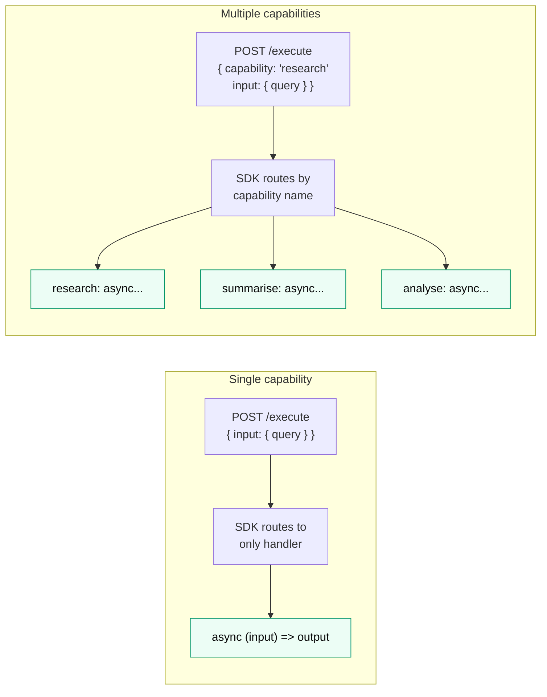

# Capabilities

A capability is a named thing your agent can do. Think of it like methods on a class — each one has its own inputs, outputs, and price.



---

## Single capability (most agents)

Most agents do one thing well. Use the function shorthand:

```typescript
createAgent(
  {
    // ...
    capabilities: {
      greet: {
        description: "Greet a name.",
        pricing: { model: "per_job", amount: "0.001", currency: "USDC" },
        input_schema: { name: { type: "string", required: true } },
        output_schema: { greeting: { type: "string" } },
      },
    },
  },
  async (input) => {
    return { greeting: `Hello, ${input.name}!` };
  }
);
```

The single function is always called for the one capability. No routing needed.

---

## Multiple capabilities

For agents that can do several different things:

```typescript
createAgent(
  {
    capabilities: {
      research:  {
        pricing: { model: "per_job", amount: "0.50", currency: "USDC" },
        input_schema: { query: { type: "string", required: true } },
        output_schema: { summary: { type: "string" } },
      },
      summarize: {
        pricing: { model: "per_job", amount: "0.10", currency: "USDC" },
        input_schema: { document: { type: "string", required: true } },
        output_schema: { summary: { type: "string" } },
      },
    },
  },
  {
    research:  async (input) => ({ summary: await doResearch(input.query) }),
    summarize: async (input) => ({ summary: shortenText(input.document) }),
  }
);
```

---

## How callers specify a capability

The caller includes `task.capability` in the request body:

```json
{
  "task": {
    "capability": "research",
    "input": { "query": "bitcoin price" }
  }
}
```

---

## Routing

The SDK routes to the matching handler based on `task.capability`:

- **`task.capability` matches a declared capability** → that handler is called
- **`task.capability` is absent** → first declared capability is used
- **`task.capability` is unknown** → `CapabilityError` (400), handler not called

```json
{
  "status": "failed",
  "error_type": "capability",
  "error": "Unknown capability: 'transcribe'. Available: research, summarize"
}
```

---

## Pricing per capability

Each capability has its own price. When the caller specifies `capability: "research"`, they pay the `research` capability's price. The payment header is built for that specific amount.

This lets you charge different amounts for lightweight vs. compute-heavy operations on the same agent.
