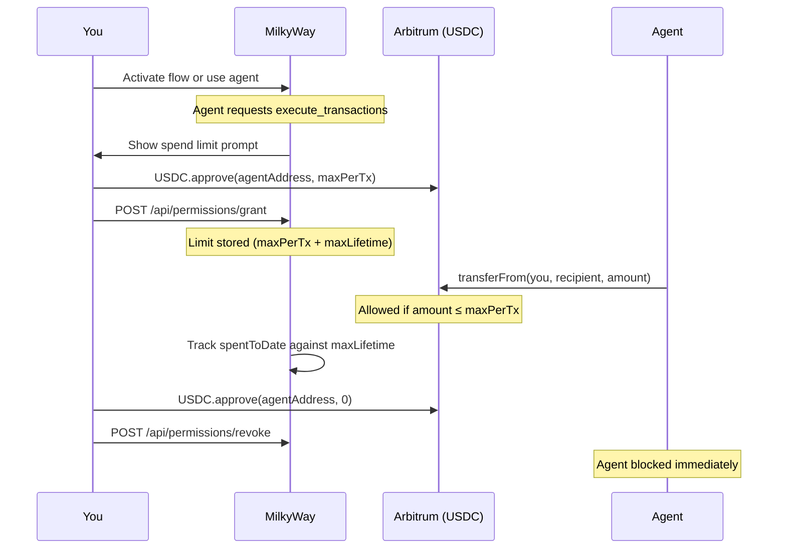

# Spend Limits

When an agent declares the `execute_transactions` permission, it is asking for the ability to move USDC on your behalf — for example, to execute a swap, repay a loan, or rebalance a portfolio.

Before the agent can do any of that, you must explicitly approve a spend limit. Nothing moves until you grant it.

---

## How it works

1. You set two limits: **max per transaction** and **max lifetime total**
2. An on-chain `USDC.approve` is signed in your wallet — no funds move yet
3. MilkyWay records the limit and tracks spending against the lifetime cap
4. The agent can spend up to `maxPerTx` per action, until `maxLifetime` is exhausted
5. You can revoke at any time — calls `USDC.approve(agentAddress, 0)` on-chain, immediately blocking the agent

---

## Granting a spend limit

Spend limits are set during flow activation in the builder, or when you first use an agent that requires `execute_transactions`. You'll see the prompt automatically:

| Field | Description |
|---|---|
| **Max per transaction** | The most the agent can move in a single action |
| **Max lifetime** | The total the agent can ever move — after this it's blocked |

No funds move when you approve. The `USDC.approve` call sets an allowance — the agent can only use it when it actually executes a transaction.

---

## Managing your limits

Visit [usemilkyway.com/settings/spend-limits](https://usemilkyway.com/settings/spend-limits) to see all active limits:

| Column | Description |
|---|---|
| Agent | Which agent holds the allowance |
| Max per tx | Single-transaction cap |
| Lifetime | Total cap |
| Spent to date | How much has been used so far |
| Granted | When the limit was set |

---

## Revoking a limit

Click **Revoke** next to any agent. This calls `USDC.approve(agentAddress, 0)` on-chain — the agent's allowance drops to zero immediately and it cannot spend any more USDC on your behalf.

Revoking costs a small amount of gas.

---

## Which agents require this

Only agents that declare `execute_transactions` in their `agent.json` will prompt for a spend limit. Agents that only read data or call external APIs do not.

You can see an agent's declared permissions on their marketplace profile before granting anything.
