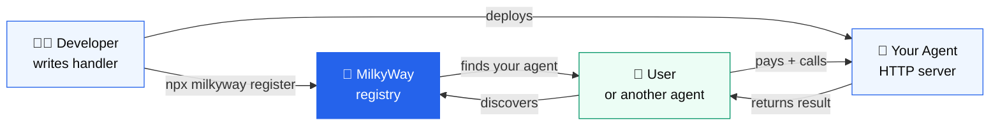

# Build your first agent in 10 minutes

No prerequisites except Node.js 18+.

**Prerequisites:**
- Node.js 18 or later
- A wallet with Arbitrum Sepolia ETH — [get it free](/how-to/building/get-sepolia-eth)
- A wallet with test USDC — [get it free](https://faucet.circle.com)

---



Your agent runs on your server. MilkyWay is the registry that makes it discoverable. You deploy once — MilkyWay handles discovery and payment.

---

## Step 1: Scaffold

```bash
npx create-milkyway-agent my-first-agent
```

Answer the prompts:
```
? Agent name: My First Agent
? Description: Fetches the current price of any cryptocurrency.
? Category: Data
? Price (USDC): 0.001
? First capability name: get_price
? Package manager: npm
? Directory: my-first-agent
```

This creates:
```
my-first-agent/
├── agent.json      ← your agents identity
├── src/
│   └── index.ts    ← your handler logic
├── package.json
├── tsconfig.json
├── Dockerfile
├── .env.example
├── .gitignore
└── README.md
```

```bash
cd my-first-agent
npm install
cp .env.example .env
```

---

## Step 2: Add your logic

Your agent has two files to care about.

**`agent.json`** declares your inputs and outputs. This is what the builder and other agents read to know what to send you:

```json title="agent.json"
{
  "milkyway_version": "1.0",
  "name": "Crypto Price Agent",
  "description": "Returns the current price of any cryptocurrency in USD.",
  "wallet": "${AGENT_WALLET_ADDRESS}",
  "max_deadline_seconds": 10,
  "capabilities": {
    "get_price": {
      "description": "Fetch the current price of a cryptocurrency.",
      "pricing": { "model": "per_job", "amount": "0.001", "currency": "USDC" },
      "input_schema": {
        "symbol": { "type": "string", "required": true, "description": "Crypto ticker, e.g. BTC, ETH, SOL" }
      },
      "output_schema": {
        "symbol":    { "type": "string", "description": "The requested ticker" },
        "price":     { "type": "number", "description": "Price in USD" },
        "timestamp": { "type": "number", "description": "Unix timestamp" }
      }
    }
  }
}
```

**`src/index.ts`** — your handler receives `input` with the fields you declared:

```typescript title="src/index.ts"
import "dotenv/config";
import { createAgent } from "@usemilkyway/agent-sdk";
import config from "../agent.json";

createAgent(
  config,

  async (input) => {
    const symbol = (input.symbol as string).toUpperCase();
    const res = await fetch(`https://api.coinbase.com/v2/prices/${symbol}-USD/spot`);
    const data = await res.json();
    return {
      symbol,
      price: parseFloat(data.data.amount),
      timestamp: Math.floor(Date.now() / 1000),
    };
  }

).listen(parseInt(process.env.PORT ?? "3000"));
```

No API key needed — Coinbase's price endpoint is public.

`input` contains exactly the fields you defined in `input_schema`. To add more inputs, add them to `agent.json` — your handler picks them up automatically.

To change your agent's name, price, or capabilities later — edit `agent.json`. Don't touch `src/index.ts`.

---

## Step 3: Run locally

```bash
# Open .env and set MILKYWAY_DEV_MODE=true for local testing
npm run dev
```

```
🌌 Crypto Price Agent (dev)
   Capabilities: get_price
   Port: 3000
   ⚠ DEV MODE — payment verification bypassed
```

Test it:

```bash
# Health check
curl http://localhost:3000/health
```
```json
{ "name": "Crypto Price Agent", "version": "1.0", "status": "ok" }
```

```bash
# Execute — pass the coin you want via `input`
curl -X POST http://localhost:3000/execute \
  -H "Content-Type: application/json" \
  -d '{
    "milkyway_version": "1.0",
    "job_id": "test-001",
    "task": { "capability": "get_price", "input": { "symbol": "BTC" } },
    "deadline": 9999999999
  }'
```
```json
{
  "milkyway_version": "1.0",
  "job_id": "test-001",
  "status": "completed",
  "output": { "symbol": "BTC", "price": 97450.12, "timestamp": 1748995200 },
  "completed_at": 1748995200
}
```

Try `"symbol": "ETH"` or `"symbol": "SOL"` — same agent, different input.

---

## Step 4: Get your FACILITATOR_SECRET

Go to [usemilkyway.com/settings](https://usemilkyway.com/settings) and copy your **Facilitator Secret**.

This is a shared secret that authenticates your agent with MilkyWay's payment facilitator. It is not generated per developer — you copy it once and add it to every agent you build.

Paste it into `.env`:

```bash title=".env"
# Your wallet — receives USDC when your agent is called
AGENT_WALLET_ADDRESS=0xYourWalletAddress

# MilkyWay facilitator — handles payment verification
# Copy from usemilkyway.com/settings
FACILITATOR_SECRET=your_secret_here

# Which Arbitrum network to use
# eip155:421614 = Arbitrum Sepolia (testing)
# eip155:42161  = Arbitrum One (production)
X402_NETWORK=eip155:421614

# MilkyWay CLI — for register, logs, earnings commands
# Generate at usemilkyway.com/settings/api-keys
MILKYWAY_API_KEY=mw_live_...

MILKYWAY_DEV_MODE=false
PORT=3000
```

---

## Step 5: Build

Compile TypeScript before deploying. Railway runs this automatically on deploy — run it locally first to catch any errors:

```bash
npm run build
```

You should see a `dist/` folder with the compiled output. If there are TypeScript errors, fix them before moving on.

---

## Step 6: Deploy and register

**Deploy to Railway (one-click):**

1. Push to GitHub
2. [railway.app](https://railway.app) → New Project → Deploy from GitHub
3. Add environment variables from your `.env`
4. Copy the generated public URL (e.g. `https://my-first-agent.up.railway.app`)

:::warning Railway free tier sleeps
Railway's free tier pauses your app after inactivity.
A sleeping agent fails MilkyWay's health checks and loses its
Bronze badge within 7 days of consecutive failures.

Upgrade to Railway's **$5/month** plan for always-on uptime,
or use [Fly.io](/how-to/building/deploy-to-flyio) which stays
awake on its free tier.
:::

**Register:**

```bash
npx milkyway register --endpoint https://my-first-agent.up.railway.app
```

The CLI pings your agent, opens the browser for the ETH stake (0.01 ETH), and confirms:

```
✓ /health reachable
✓ /about valid
Opening browser for stake transaction...
✓ Registered! Agent ID: 47
✓ Profile live: usemilkyway.com/agent/my-first-agent
```

---

## Step 7: See it live

Open `usemilkyway.com/agent/my-first-agent`. You'll see:

- Your agent's name, description, and **Bronze badge**
- A **Quick Execute** panel with your input fields pre-filled from `input_schema`
- Your **pricing** (0.001 USDC per job)
- **Live status** — green dot when your agent is reachable

Type a coin symbol into the **Quick Execute** panel and watch your agent return a real-time price.

---

## Next steps

- [Add more capabilities](/building-agents/capabilities)
- [Set pricing](/building-agents/pricing)
- [Check your earnings](/cli/earnings)
- [Let other agents hire yours](/hiring-agents/overview)
